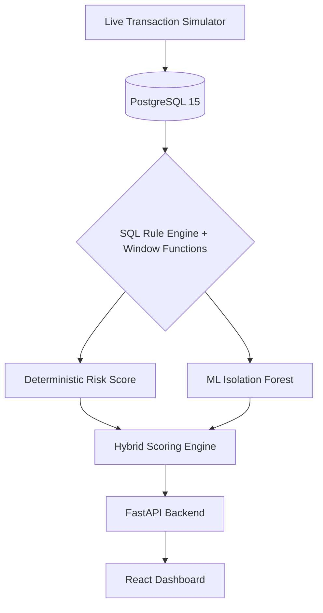

# 🛡️ Hybrid Fraud Detection Engine

A practical, full-stack Transaction Anomaly Detection engine that combines the explainability of SQL Rule-Based detection with the probabilistic power of Machine Learning.

## 🚀 Features

- **Live Transaction Simulator**: Continuously generates realistic financial transactions in the background and occasionally injects synthetic fraud (e.g. Card Testing, Value Anomalies).
- **Advanced SQL Detection Layer**: Uses PostgreSQL Window Functions and CTEs to evaluate complex fraud vectors in real-time, including:
  - 🏃‍♂️ **High-Velocity Card Testing**: Detects >5 transactions within a rolling 2-minute window.
  - 💸 **Value Anomalies**: Calculates a rolling Z-Score based on the user's historical transaction average and standard deviation.
  - ✈️ **Impossible Travel**: Uses the `earthdistance` extension to calculate the travel speed between consecutive transactions and flags unrealistic physical movement (>1000 km/h).
- **Machine Learning (Isolation Forest)**: An unsupervised `scikit-learn` model trained on SQL-engineered features to detect subtle multidimensional anomalies.
- **Premium React Dashboard**: A dark-mode, auto-refreshing investigation dashboard built with Vite, Tailwind CSS, and Recharts.

## 🏗️ Architecture



## 🛠️ Quick Start

This project is fully containerized. You do not need to install Python or Node locally.

1. **Clone the repository** (if applicable).
2. **Start the stack** using Docker Compose:
   ```bash
   docker compose up --build -d
   ```
3. **Wait a few seconds** for the database to initialize and the ML model to load.
4. **Open the Dashboard**:
   Navigate to [http://localhost:5173/](http://localhost:5173/) in your browser.

You will see the dashboard populate with data. As the simulator runs in the background, you will see new transactions automatically appearing in the timeline!

## 🧑‍💻 Development

If you want to run the pieces locally without Docker:

**1. Database**
```bash
docker compose up db -d
```

**2. Backend API**
```bash
cd backend
python -m venv venv
source venv/bin/activate
pip install -r requirements.txt
uvicorn main:app --reload
```

**3. Frontend**
```bash
cd frontend
npm install
npm run dev
```
